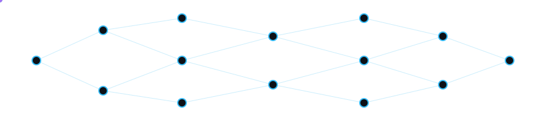
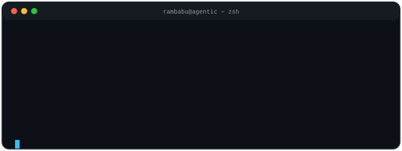
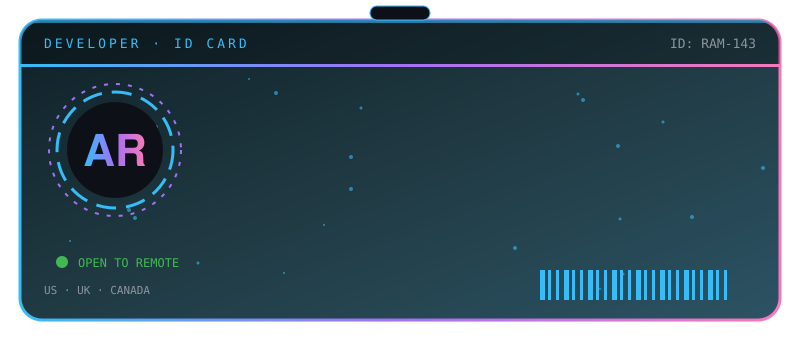
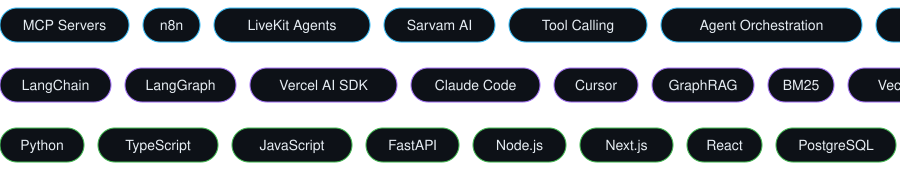
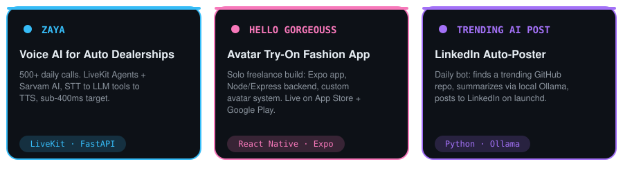

---

# 🪪 Developer ID

---

# 💫 About Me

AI engineer who designs and ships agentic systems end to end: **MCP tooling, n8n automation, hybrid RAG and multi-agent workflows**, plus a production voice AI deployment. I architect the system, write the code, and build the pipelines that replace manual operations in production.

> I don't just integrate AI. I build systems that think, act, and execute. 🔥

---

# 📈 Impact

---

# 🌐 Connect With Me

---

# ⚡ Skills in Motion

### 🤖 AI & Agents
LLM integrations • Prompt engineering • Tool calling • Agent orchestration • Structured outputs • Guardrails • Multi-agent systems  
MCP servers • n8n workflows • Webhook-driven pipelines • LiveKit Agents • Sarvam AI • Real-time STT/TTS  
Hybrid retrieval (BM25 + vector + graph) • FalkorDB • RRF fusion • Cross-encoder reranking  
LangChain • LangGraph • Vercel AI SDK • Claude Code • Cursor

### 💻 Full Stack & Cloud
Python • TypeScript • JavaScript • FastAPI • Node.js/Express • Next.js • React • Tailwind CSS  
PostgreSQL • Supabase • AWS • GCP • Docker • Vercel • Git

---

# 🛣️ Journey

- **Arohak Inc** · AI Engineer (Mar 2026 – Sep 2026): Go CLI that scaffolds MCP servers end to end, GraphRAG pipeline for multi-hop retrieval, unattended n8n automation in production
- **Cyepro Solutions** · GenAI Engineer, Contract (Jul 2025 – Feb 2026): architected and shipped **Zaya**, the production voice agent for a US dealership DMS
- **Ordermatic Technologies** · Software Development Engineer (Apr 2024 – Apr 2025): full-stack on a live restaurant POS (billing, CRM, inventory)

---

# 🏆 Featured Projects

- 🎙️ **Zaya**: 500+ daily calls, STT → LLM tool-calling → TTS on LiveKit Agents, retries/timeouts/fallback routing
- 👗 **Hello Gorgeouss**: live on [App Store](https://apps.apple.com/in/app/hello-gorgeouss/id6739887399) and [Google Play](https://play.google.com/store/apps/details?id=com.hellogorgeous)
- 📣 **[Trending AI Post](https://github.com/rambabu-143/Trending-AI-Post)**: daily GitHub → local LLM → LinkedIn bot

---

# 🎤 Speaking & Teaching

---

# 🎓 Education

**B.Tech in Computer Science Engineering**: Bharat Institute of Engineering and Technology, Hyderabad (2019 – 2023)

---

# 📊 GitHub Analytics

---

# 🐍 Contribution Snake

<picture>
<source media="(prefers-color-scheme: dark)" srcset="https://raw.githubusercontent.com/rambabu-143/rambabu-143/output/github-snake-dark.svg"/>

</picture>

---

# 🏆 GitHub Trophies

---

